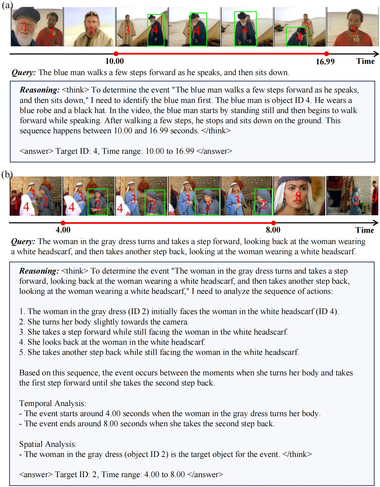

# STVG-R1: Incentivizing Instance-Level Reasoning and Grounding in Videos via Reinforcement Learning

<div style='display:flex; gap: 0.25rem; '>
  <a href='./STVG-R1.pdf'></a>
  <a href='https://huggingface.co/XiaowenZhang/stvg-r1-model-7b'></a>
</div>

### Overview

STVG-R1 is the first reinforcement learning framework for spatial–temporal video grounding. We introduce a simple yet effective object-centric visual prompting paradigm that reformulates dense per-frame coordinate prediction into a compact object ID identification task. Extensive experiments on six benchmarks demonstrate the effectiveness of our approach.

Key Features:

* **Object-Centric Visual Prompt**: A simple yet effective object-centric visual prompting paradigm reformulates dense per-frame coordinate prediction into a compact object ID identification task.
* **Reinforcement Learning Training**: STVG-R1 is trained entirely using reinforcement learning, enhancing its ability to generate accurate spatial temporal visual grounding results.
* **Strong Zero-Shot Generalization**: STVG-R1 exhibits strong zero-shot generalization to multi-object referring video object segmentation task, despite being trained only on single-object grounding data.
* **SOTA Performance**: STVG-R1 sets a new SOTA on the HCSTVG-v1, HCSTVG-v2, ST-Align and MeViS benchmarks.


**Examples:**




## Environment Configuration

The environment setup of this project is based on the configurations provided in:

-   [GroundedSAM2](https://github.com/IDEA-Research/Grounded-SAM-2)
-    [Time-R1](https://github.com/www-Ye/Time-R1)

## Data Preprocessing

Download the dataset [HCSTVG-v1](https://github.com/tzhhhh123/HC-STVG), [HCSTVG-v2](https://github.com/tzhhhh123/HC-STVG), [VidSTG](https://github.com/tzhhhh123/HC-STVG).

Before training, you need to preprocess the video data.

**1. Object Extraction and Tracking (Training & Inference)**

We first extract all objects of interest and obtain a temporally consistent mask sequence. 

```bash
cd preprocess
bash rundettrack.sh \
    --target_mode person \
    --video_base_dir ../hcstvg-v2/video/mnt/data1/tzh/HCVG/video_parts \
    --base_output_dir ../vipdata/hcstvgv2 \
    --hcvg_json_path ../hcstvgv2/anno_v2/train_v2.json
```
Specify the path to the HCSTVG-v2 dataset (video files, annotations, etc.).

**2. Mask-to-ID Visual Prompt Generation (Training & Inference)**

We convert each instance mask into a compact, unique object ID, and overlay these IDs onto video frames as visual prompts.

```bash
python mask2marker.py
```

**3. Ground-Truth ID Generation (Training Only)**

For the training set, we further generate ground-truth ID labels to supervise our reinforcement learning framework.

```bash
python trainjson.py
```

**4. Video Preprocessing for Model Training (Training & Inference)**

Preprocess videos with visual prompts using Qwen2.5-VL-7B processor and save them as PyTorch tensors for efficient training.

```bash
bash scripts/preprocess_video.sh
```

## Training

Train the model using GRPO algorithm for spatial-temporal video grounding.

```bash
bash scripts/run_grpo_video.sh
```

## Evaluation

After training, evaluate your model's performance:

```bash
bash scripts/evaluate.sh
```

## Results

**HCSTVG**

STVG-R1 establishes new state-of-the-art results on both HCSTVG-v1 and HCSTVG-v2. 

-   **HCSTVG-v1:**

| Models | m_tIoU | m_vIoU | vIoU@0.3 | vIoU@0.5 |
| ------ | ------ | ------ | -------- | -------- |
| TubeDETR | - | 32.4 | 49.8 | 23.5 |
| STVGFormer | - | 36.9 | 62.2 | 34.8 |
| CG-STVG | 52.8 | 38.4 | 61.5 | 36.3 |
| TA-STVG | 53.0 | _39.1_ | 63.1 | 36.8 |
| SpaceVLLM-7B | **56.9** | **39.3** | _66.6_ | _36.9_ |
| **STVG-R1 (ours)** | **56.9** | _39.1_ | **66.7** | **38.6** |

-   **HCSTVG-v2:**

| Models | m_tIoU | m_vIoU | vIoU@0.3 | vIoU@0.5 |
| ------ | ------ | ------ | -------- | -------- |
| TubeDETR | 53.9 | 36.4 | 58.8 | 30.6 |
| STVGFormer | 58.1 | 38.7 | 65.5 | 33.8 |
| CG-STVG | 60.0 | 39.5 | 64.5 | 36.3 |
| TA-STVG | _60.4_ | **40.2** | _65.8_ | _36.7_ |
| SpaceVLLM-7B | 58.0 | 34.0 | 56.9 | 24.7 |
| **STVG-R1 (ours)** | **62.0** | **40.2** | **67.8** | **38.8** |

---

**ST-Align**

STVG-R1 significantly improves spatial-temporal grounding and spatial grounding performance, surpassing recent VLMs such as LLava-ST-7B.

| Models | tIoU@0.5 | m_tIoU | vIoU@0.3 | vIoU@0.5 | m_vIoU |
| ------ | -------- | ------ | -------- | -------- | ------ |
| GroundingGPT-7B | 7.1 | 12.2 | 19.7 | 2.9 | 9.2 |
| LLava-ST-7B | **44.6** | _43.8_ | _47.2_ | _21.1_ | _22.8_ |
| Qwen2.5-VL-7B | 35.2 | 37.4 | 44.6 | 17.1 | 14.3 |
| **STVG-R1 (ours)** | _43.6_ | **45.1** | **60.3** | **25.9** | **23.4** |

---

**MeViS (Zero-shot)**

STVG-R1 also demonstrates strong zero-shot generalization.

| Models | J | F | J&F |
| ------ | ---- | ---- | ---- |
| URVOS | 25.7 | 29.9 | 27.8 |
| MTTR | 28.8 | 31.2 | 30.0 |
| VISA | 40.7 | 46.3 | 43.5 |
| VideoGlaMM | _42.1_ | _48.2_ | _45.2_ |
| **STVG-R1 (ours)** | **44.7** | **50.0** | **47.3** |

---

**Charades-STA and TVGBench (Zero-shot)**

STVG-R1 achieves leading performance on temporal video grounding benchmarks.

| Models | Charades@0.3 | Charades@0.5 | TVGBench@0.3 | TVGBench@0.5 |
| ------ | ------------ | ------------ | ------------ | ------------ |
| TimeSuite | 69.9 | 48.7 | 31.1 | 18.0 |
| LLaVA-ST | _63.1_ | _44.8_ | - | - |
| Time-R1 | **78.1*** | **60.8*** | _41.8_ | **29.4** |
| **STVG-R1 (ours)** | **73.2** | **52.5** | **42.5** | _27.4_ |


## Acknowledgements

We thank the authors of the following projects for their contributions:

*   [GroundedSAM2](https://github.com/IDEA-Research/Grounded-SAM-2)
*    [Time-R1](https://github.com/www-Ye/Time-R1)
*   [Qwen2.5-VL](https://github.com/QwenLM/Qwen2.5-VL)

## Citation


```bibtex
@article{zhang2026stvg,
  title={STVG-R1: Incentivizing Instance-Level Reasoning and Grounding in Videos via Reinforcement Learning},
  author={Zhang, Xiaowen and Gao, Zhi and Jiao, Licheng and Li, Lingling and Li, Qing},
  journal={arXiv preprint arXiv:2602.11730},
  year={2026}
}
```

